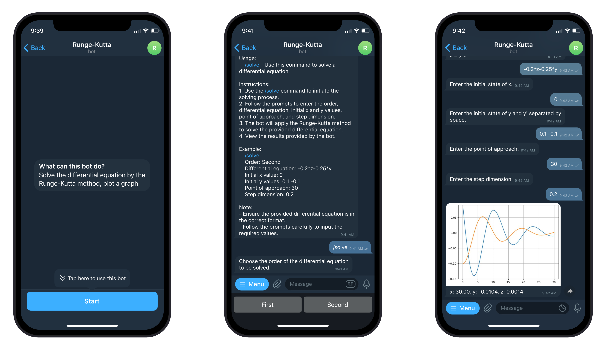

<h1 align="center"> Runge-Kutta Solver Bot </h1>



This bot is developed to solve 1st and 2nd order differential equations using the Runge-Kutta method, a numerical technique for solving ordinary differential equations.

## Installation

If you have Docker, you can install the program in a couple of clicks. All you need to do is replace the line `YOUR_TOKEN` with your Telegram bot token in the [dockerfile](dockerfile) itself.

If you don't have Docker, you can use the following instruction to install it manually.

### Prerequisites

- Python 3.9 or above
- Java 8
- Maven

### Bot Installation

Clone the repository to a convenient location and install all the required libraries from [requirements.txt](requirements.txt).

**Installation on Linux:**
```bash
python3 -m venv .venv
source .venv/bin/activate
pip install -r requirements.txt
```

**Installation on Windows:**
```bash
python -m venv .venv
.venv\Scripts\activate
pip install -r requirements.txt
```

Requirements:

```python
matplotlib==3.8.2
numpy==1.26.3
py4j==0.10.9.7
python-telegram-bot==20.7
sympy==1.12
```

After activating the virtual environment, you'll need to get the Telegram bot token and enter it into [config.json](solver-bot/src/main/python/config/config.json).

```json
"TELEGRAM_TOKEN": "YOUR_TOKEN"
```

### Java Server Installation
You'll need Maven and Java 8 to run it.
```bash
mvn clean install
```

## Usage
To use the bot, you need to run [main.py](solver-bot/src/main/python/main.py).
```bash
python3 solver-bot/src/main/python/main.py # <python> on Windows
```

## License

Distributed under the MIT License. See [LICENSE](LICENSE) for more information.
